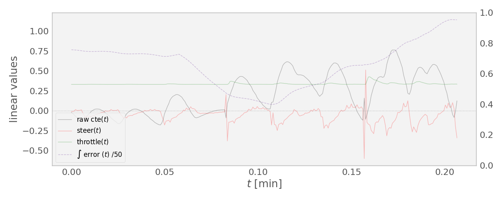
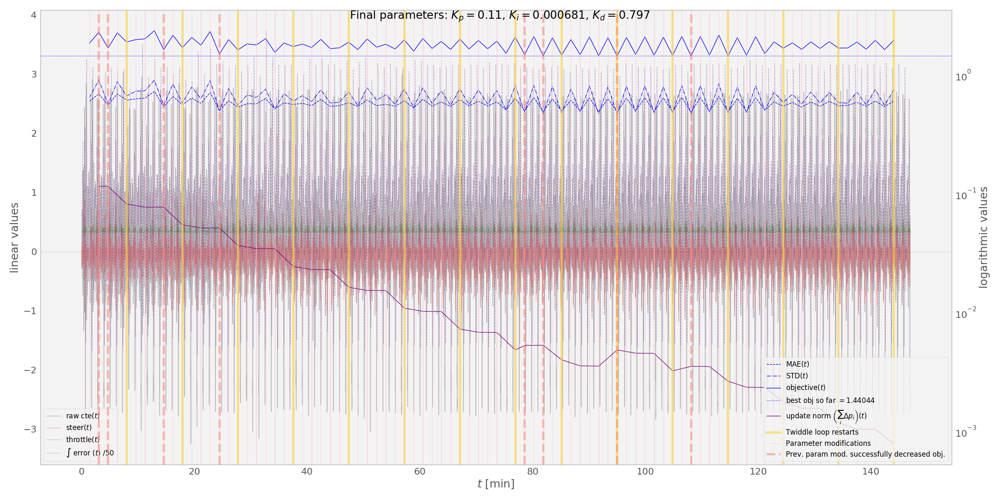
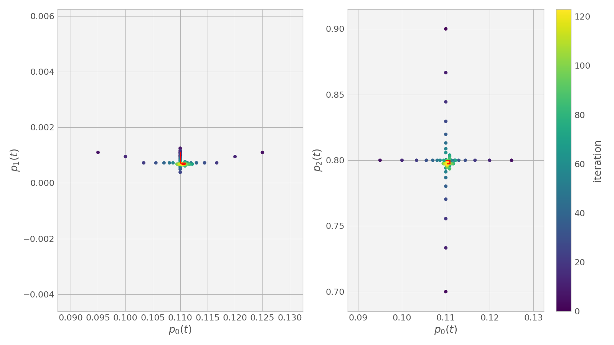
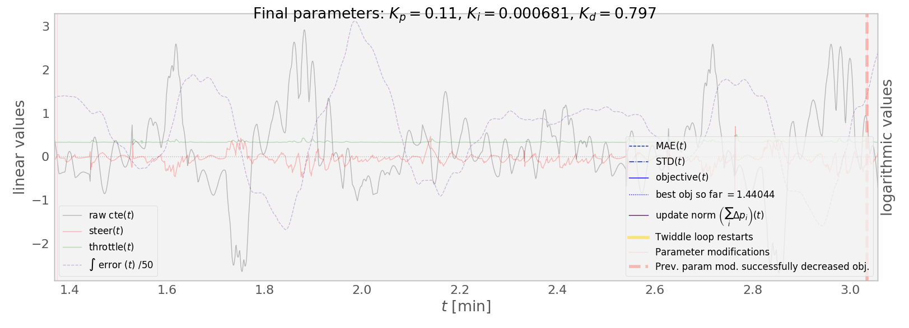
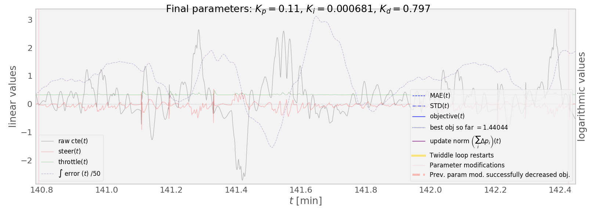
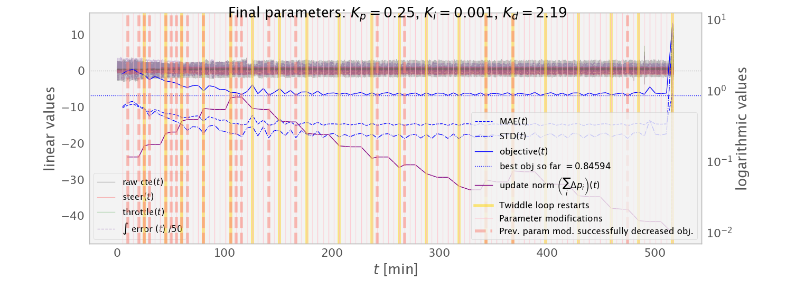
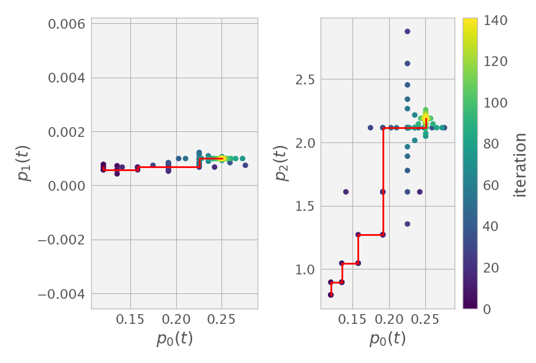

# PID Controller in C++
[](http://www.udacity.com/drive)


## Implementation Details


##### Calculating the PID terms and maintaining the error FIFO queue

The basic PID loop is pretty simple.

```c++
/*
 * @brief       Do the actual PID computations.
 * @param[in]   cte             the error signal to be driven to zero
 */
void PID::UpdateError(double cte) {
    cte_history.push_back(cte);
    d_error = cte - p_error;
    p_error = cte;
    i_error += cte;

    if(cte_history.size() >= MAX_CTE_HISTORY_LENGTH) {
        i_error -= cte_history[0];
        cte_history.pop_front();
    }

}
```

Calculating the `d_error`, `p_error`, and `i_error` terms
is straightforward.
One possible improvement would be to measure the actual time difference between updates
so that we actually approximate the time derivative of the error and the integral (over time) of the error
in the correct units.
This might give more reproducible results across computers. 
I measured an update time of about 49 milliseconds on one machine, but didn't verify that this was the same across multiple.

In addition to computing the three error terms,
I don't add up error terms for the integral term indefinitely.
This makes it difficult for the the system to forget long-ago large errors,
and makes it more likely that a small error term can explode over time
with a moderately sized `Ki` coefficient.

Instead, I accumulate error history in a `std::deque<double>` FIFO queue of a limited length (about ten seconds).
When a new error value is pushed (and added to the running total),
the oldest is popped (and subtracted from the running total).
So, the running total is only the sum of the last few seconds of error values.


##### PID control of both speed and heading

I use `PID` controller objects to choose both the steering angle and the throttle ("manipulated values" or MVs).
Both are [reverse-acting controllers][1], in that as their process variables (PVs) increase,
the controllers respond by decreasing the MVs.
The PV for the steering angle is the cross-track error (CTE), and the PV for the throttle is the speed.

Through most of the circuit, the throttle stays at a steady value, 
so conceivably setting a constant throttle would have been sufficient.
Instead, I use a fixed speed set point. 
Initially, considered setting the speed set point as a function of the current steering angle, 
such that tight turns would naturally lead to a decreased speed target. 
However, I found that this created an unpredictable feedback between the speed and steering controllers
which was difficult to reason about.
I believe that, to reach higher speeds on the straight segments,
speed reduction on the tight curves is necesssary.
However, as any driver knows, it's necessary to slow down *before* a curve,
so I think this interaction can be withheld until the later implementation 
of the forward-looking model-based controller.

I also thresholded the outputs of both controllers for utilitarian reasons.
As the steering angle was only meaningful in the `[-1, 1]` range, I clipped the controller's output to these bounds.
And, while allowing "negative throttle" (breaking) mostly worked fine 
for keeping to the prescribed speed, I found that quick switches 
between acceleration and breaking, while physically meaningful,
sometimes caused the simulator to glitch 
as if stuck on an invisible wall until manually backed up momentarially,
so I limited the speed controller to positive outputs.


##### Rough PID tuning by Ziegler-Nichols and intuition.

The [Ziegler-Nichols (ZN)][2] method is a method for setting the `Kp`, `Ki`, and `Kd` coefficients for a PID controller heuristically in terms of the characteristic relaxation oscillation frequency of the system and in terms of a "critical" value for the `Kp` coefficient, at which this oscillation begins while the other two coefficients are set to zero. However, the testing procedure for measuring these coefficients should normally involve a step change in the set point, whereas the simulation environment we have available only allows for smoothly a varying set point.

Oscillations in the CTE are abundant, and frequently seem to have approximately the same period, which I very approximatley measured as 1.635 seconds, which I divide by the PID sampling period of about 0.049 s to get `Tc`, since the PID code above is not in units of seconds. Measuring the critical value of `Kp` was more difficult, and I believe that the lack of a proper set point perturbation procedure biased my estimated value of `Kc=0.05` low.

There are several options for the form of the ZN heuristic for the PID parameters, but I used the expressions `Kp=0.6*Kc`, `Ki=2./Tc`, and `Kd=8./Tc`.

This produced a reasonable value for the `Kd` parameter, but, emperically, better performance was obtained 
by decreasing the suggested value of the `Ki` coefficient by an order of magnitude,
increasing `Kp` as much, and even by approximately quartering `Kd`.

After this abortive heuristic start and viewing recordings as in the figure below, I used several intuitions about the PID coefficients to make manual adjustments to the PID coefficients.



This plot was created with `Kp=0.11`, `Ki=0.001`, and `Kd=2.0`, with a speed target of 40 mph, and demonstrates several pathological traits. Note that all of these PID tuning results were obtained with a target speed of 40 mph. At slower or faster speeds, different coefficients would be appropriate; providing a further motivation for future model-based control.
Generally, it appears that higher speeds require  smaller PID parameters.
This is reflected in the kinematic motion model

    ψ(t+1) = ψ(t) + v/L ∗ δ ∗ dt

where ψ is the yaw angle,
v is the forward velocity,
L is the distance from axel to center of mass,
and δ is the turn angle.
I.e., yaw rate depends on speed.

First, the relatively large value for `Kd` magnified small instantaneous deviations in the CTE PV,
(and especially the likely spurious deviation at 0.15 minutes as the car exits the bridge),
creating many small spikes in the steering MV.
Decreasing `Kd` amplifies less the high-frequency noise, 
but simultaneously loses the low-frequency dampening effect by which the derivative term anticipates overshoots.

While one possible conclusion from this amplification by the `Kd` term of of small fluctuations
is that `Kd` is too large, another is that a smoothed measure of the time derivative of the error would work better,
such as the mean of several recent values, or (perhaps equivalently), a short-time linear fit.

Second, between about 0.08 and 0.2 minutes, as the car rounds a broad curve, the relatively weak `Ki` coefficient leads to an accumulating positive error being underpenalized. At higher speeds, this is difficult to avoid without prompting an exploding integral term,
but at speeds lower than 40 mph, this diagnosis might might make a stronger `Ki` coefficient more feasible.

Third, the fact that the oscillations in the MV are π/2 out of phase with the PV
suggests that [the oscillations are driven by the integral term][3], 
further suggesting that the integral term cannot be increased much further without worsening the performance.
The alternative situation, in which the PV and the MV peak in synchrony or anti-synchrony
suggests proportional-driven oscillation, which has proven a more common situation in this project.

With these observations, it was possible to produce a reasonably good initial values for an automatic fine-tuning process.


##### Online PID training with coordinate ascent, or "twiddle"

After getting the PID coefficients in the neighborhood of good values
by a combination of ZN and intuition about their effects,
I ran coordinate ascent  (CA) as suggested in an attempt at fine-tuning. 

CA keeps track of both the parameter vector and a step size vector
 at each iteration.
At each step, we loop over the parameters, first attempting an increase by the corresponding step size, then a decrease, then a return to the original value.
If either the increase or decrease succeeded 
in decreasing some loss function (discussed below),
we increase the corresponding step size by 50% and move on to the next parameter.
If both increasing and decreasing the parameter increased the loss,
we decrease the step size by 50% and move on to the next parameter.
We repeatedly loop through the parameters making these changes ("twiddling")
until the sum of the step size vector is below some threshold.

For this project, I used as loss function the sum of the mean absolute CTE
and the standard deviation of the CTE over a short period of sample driving.
Using a different loss function would likely provide very different results.
However, experimenting with the loss was an expensive proposition
becase each sample required several minutes of autonomous driving.
If samples were too short, the signal of response to parameter changes
would be drowned out by the noise of the naturally variable test course.

Below, I plot the objective function and its two components over several hours of twiddling. Vertical yellow lines show the restarts of the inner loop over parameters. Vertical dashed salmon-colored lines show actual decreases of the objective, after which the previously set parameters were kept. There are not many of these.



The fact that this is a fine-tuning process, rather than a from-scratch
parameter selection, is visible both in the sparsity of these dashed markers
and in the following plot of evolution through parameter space.
the `{p[0], p[1], p[2]}` vector corresponds to the three `Kp`, `Ki`, `Kd` PID coefficients.
Scattered points show the many attepts at parameter steps, most of which were rejected. As many rejections accumulate, the steps get smaller and smaller, eventually settling on a point near the start. 
The red line shows the short trajectory of accepted parameter updates,
which even includes some backtracking in `p[0].`



Nevertheless, there was some qualitatively notable improvement
in the line the car takes, as visible in the following two blow-ups of the previous error history plot. The large swing from negative to positive CTE around 1.8 min
corresponds to the same curve on the test track as the similar, 
but slightly smaller swing around 141.5 min in the second figure.
However, the subsequent negative swing (at 2 min and 141.7 min, respectively)
is noticably reduced in the second plot, 
as is the overcorrection following that (2.2 min and 141.8 min).
These results were typical of laps near the beginning of training 
and laps near the end.




In order to further dampen the noise course noise and magnify the signal from parameter changes, I quadrupled the number of samples to evaluate each parameter 
change to about five minutes (or about 4.5 laps). 
This gave the solver a better idea of what the effect of each parameter choice was, allowing for more accepted parameter modifications. (See figures below.)
However, it became apparent that the chosen objective function had the effect of generally keeping close to the centerline 
at the expense of making large adjustments that sometimes led to catastrophe.
(Eventually the run ends with an unrecoverable crash.)
Some regularization might be helpful here; e.g. adding a term to the objective minimizing interventions.




**This process would have been much easier 
if it were possible to issue a "teleport" command to the simulator.**
This would allow for a consistent starting point for each test run, rather than just using a long run (around the whole track one or two times) and online tuning.
Additionally, a teleport command would allow for recovery after crashes due to bad parameters, further allowing for more aggressive parameter steps, or indeed other optimization methods. While I'm mentioning possible improvements to the simulator, **it would be nice to be able to simulate multiple vehicles in parallel,** say, to approximate a gradient vector stochastically. Of course, this would be easier if the simulator offered a real "fastest" rendering mode (the current "fastest" mode is visually indistinguishable from the "fantastic" mode).


## Dependencies

* cmake >= 3.5
 * All OSes: [click here for installation instructions](https://cmake.org/install/)
* make >= 4.1(mac, linux), 3.81(Windows)
  * Linux: make is installed by default on most Linux distros
  * Mac: [install Xcode command line tools to get make](https://developer.apple.com/xcode/features/)
  * Windows: [Click here for installation instructions](http://gnuwin32.sourceforge.net/packages/make.htm)
* gcc/g++ >= 5.4
  * Linux: gcc / g++ is installed by default on most Linux distros
  * Mac: same deal as make - [install Xcode command line tools]((https://developer.apple.com/xcode/features/)
  * Windows: recommend using [MinGW](http://www.mingw.org/)
* [uWebSockets](https://github.com/uWebSockets/uWebSockets)
  * Run either `./install-mac.sh` or `./install-ubuntu.sh`.
  * If you install from source, checkout to commit `e94b6e1`, i.e.
    ```
    git clone https://github.com/uWebSockets/uWebSockets 
    cd uWebSockets
    git checkout e94b6e1
    ```
    Some function signatures have changed in v0.14.x. See [this PR](https://github.com/udacity/CarND-MPC-Project/pull/3) for more details.
* Simulator. You can download these from the [project intro page](https://github.com/udacity/self-driving-car-sim/releases) in the classroom.

There's an experimental patch for windows in this [PR](https://github.com/udacity/CarND-PID-Control-Project/pull/3)


## Basic Build Instructions

1. Clone this repo.
2. Make a build directory: `mkdir build && cd build`
3. Compile: `cmake .. && make`
4. Run it: `./pid`
5. Alternately, run the twiddle tuning attept: `./twiddle`


[1]: https://www.controlglobal.com/articles/2014/controllers-direct-vs-reverse-acting-control/
[2]: https://en.wikipedia.org/wiki/Ziegler%E2%80%93Nichols_method
[3]: https://www.crossco.com/blog/basics-tuning-pid-loops
